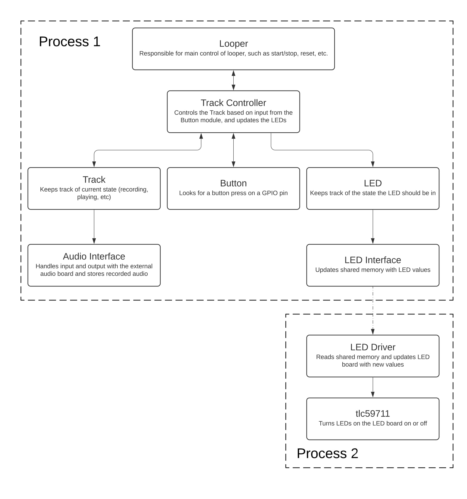
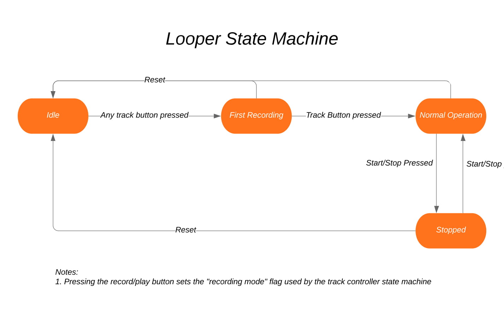
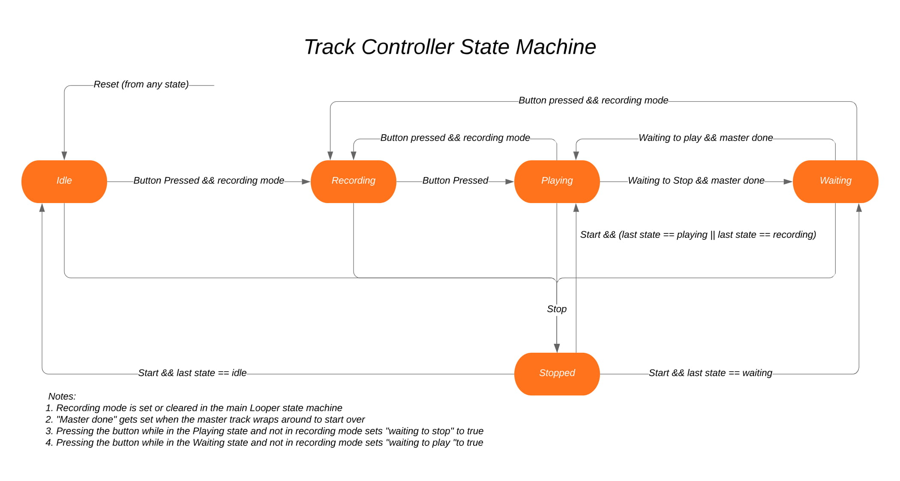

# Cizies Audio Looper

Multitrack audio looper based on a Raspberry Pi Zero.

## Software Overview

The following block diagram shows all of the classes and modules used in the system and provides a high-level overview of how they interact with each other. As can be seen in the block diagram, the firmware is split into two separate processes. The first process is the main looper system, which handles everything from the audio to the buttons to recording and playing back tracks. The second process is the LED driver, which interfaces with the TLC59711 to turn LEDs on or off as needed. These two processes communicate with each other through shared memory. The looper process updates the shared memory with new LED values as needed, which are then updated by the LED driver as it checks the shared memory periodically. A more detailed description of each process, along with each firmware module, is provided in the following sections.

### Process 1: Looper

The looper process is responsible for running the whole system, except for updating the LEDs through the LED driver board. During initialization, this process creates a separate, high-priority, real-time thread to be used for the audio processing. This audio thread, which will be detailed later, communicates with the Fe-Pi audio board to send or receive audio as needed. It is run in its own high-priority, real-time thread because this is the most time-critical feature of the system. Setting the thread up this way ensures that whenever audio processing needs to happen, the operating system will immediately let this thread run and will give it as much time as it needs. The initial (normal) thread is then responsible for running the looper system, which consists of simply running the state machine in the Looper class. A detailed description of each class and module now follows.

#### Main

The main file initializes the system, then runs the Looper’s state machine in a while(1) loop. Between each “tick” of the Looper’s state machine, the main loop sleeps for approximately 2ms. This delay allows the operating system to run other tasks as needed, but still run this task frequently enough to reliably and quickly detect button presses and update the state machines.

#### Audio Interface

As previously mentioned, the audio interface runs in its own high-priority, real-time thread. This thread is run by the operating system whenever the Fe-Pi audio board needs new audio or has audio to give to the Pi. Each time it runs, the audio interface looks at all the tracks it has been made aware of, and handles audio appropriately. If a specific track is set to record, for example, the audio interface will record the incoming data to that track’s audio buffer. If a track is set to play back, audio from that track’s audio buffer is added to the output to be sent to the Fe-Pi audio board.

The actual interfacing with the external audio board is aided by the PortAudio library, which is “a free, cross-platform, open-source, audio I/O library” (portaudio.com) that can run on Linux, including Raspbian on a Raspberry Pi. This library provides a C API so that it can be integrated directly into audio projects. With this library, the audio board shows up as a device, so I use this library to open the device, configure the sample rate and number of channels, and set up a callback for when audio is needed.

#### Looper

The Looper class is responsible for the high-level control of the looper system. It runs a state machine based on the design shown in block diagram below. After system initialization, the Looper starts in the Idle state. It waits here until one of the track buttons is pressed, in which case the system starts recording on that track and the Looper moves to the First Recording state. Once that same track button is pressed again, the system stops recording and starts playing back the recorded audio, and the Looper moves to the Normal Operation state. The Looper will then spend most of its time in this state. It only moves out of this state if the reset button or the start/stop button is pressed. If the reset button is pressed, the Looper resets everything back to default, and instructs all other modules to do the same. If the start/stop button is pressed, all audio output is stopped, and the Looper moves into the Stopped state. Once the start/stop button is pressed again, the Looper moves back into normal operation. It is also important to note that in each tick of the Looper state machine, a call to each Track Controller’s and Button’s tick function is also called.

#### Track Controller

The track controller is responsible for managing everything associated with a track on the looper. This includes the Track itself, a Button, and two LEDs. The Track Controller looks for a button press from its associated button, and when it sees one, it updates the Track and LEDs accordingly. The following block diagram shows the design of the Track Controller’s state machine. Once created, the Track Controller starts out in the Idle state. Once its Button is pressed, it instructs the Track to start recording audio and moves into the Recording state. It will keep recording until the Button is pressed again, in which case it will tell the Track to stop recording, and will move into the Playing state. Another press of the Button will cause the Track Controller to move either to the Recording state or the Waiting state, depending on if the Looper is in recording or playing mode. Once back in recording mode, the track will continue to playback, but will also be recording new audio. In the Waiting state, the track is neither playing nor recording. It is waiting for the Button to be pressed again, in which case it will move to either the Recording or Playing state again. The Stopped state is for when the user has pressed the start/stop button. This state is similar to the Waiting state, in that the track is neither playing nor recording. The difference is that the only way to transition out of this state is through another press of the start/stop button, in which case the Track controller will go back to the state it was last in (except if the state was in the Recording mode when the button was pressed. In this case, it will return to the Playing state).

#### Track

The Track class is a very simple class. It simply keeps track of the current state of the audio track with two Boolean variables, ‘playing’ and ‘recording’, which get updated by the Track Controller when necessary. The Audio Interface looks at these variables each time it runs to determine if it needs to record audio to the track, play audio from the track, or neither.

#### Button

The Button class is responsible for detecting and debouncing a button press on a specific GPIO pin. The class has a “tick” function, which gets called each time the main state machine runs. Each time this tick function runs, the Button object queries the state of the GPIO pin. The pin is internally pulled high, so as soon as a low value is detected on the pin, the Button reports a button press. Once the press has been detected, the Button starts a counter for debouncing. This counter is then decremented each tick until it returns to zero. As long as the counter is non-zero, the Button will not report another button press. The count is 250, and each tick is approximately 2ms apart, so the Button will not report another press for approximately half a second. This is sort of an arbitrary amount of time, but it is long enough that the Button will not report multiple presses when only pressed once, but short enough that the user would never try to press the button again before it timed out.

Note that I said approximately 2ms and approximately half a second. This is because the main loop requests to sleep for 2ms between each run through the state machines. In reality, this time delay could be longer by a few milliseconds as the operating system is running other tasks. This is fine, because the only time-critical presses are the first and second button presses (to start and stop recording the initial track), and even then, a few more milliseconds will not be noticeable by the user. After these two critical presses, the need for precise timing is further reduced. Starting to record on a new track 100ms later than expected, for example, would probably not even be noticeable to the user. It is also important to note here that these times refer only to when the track is told it should update its recording or playing variables – it does not refer to the timing of the audio itself. The actual timing of the audio (what data to record/play when), which is far more time-sensitive than the timing here, is handled by the Audio interface on a much tighter schedule.

I also make use of the BCM2835 library in the Button class. This library is “a C library for Raspberry Pi (RPi). It provides access to GPIO and other IO functions on the Broadcom BCM 2835 chip, as used in the RaspberryPi” (https://www.airspayce.com/mikem/bcm2835). Once installed, this library provides an easy way to initialize GPIO pins and query the state of the pins. This library is also used by the LED driver, as mentioned below.

#### LED

The LED class is another simple class. It keeps track of if the LED is on or off, and if it needs to be flashing or not. Similar to the Button class, it has a tick function which uses a counter to time events, in this case to turn on or off the LED if it is supposed to be flashing. When an LED needs to be turned on or off, it does so by a function call to the LED Interface.

#### LED Interface

The LED Interface’s only job is to update shared memory with new LED values as needed. When an LED is turned on or off, that LED’s value is simply updated in the shared memory, and a flag is set to led the LED driver know that it needs to update the LEDs.

### Process 2: LED Driver

The LED Driver process only has one job: to update the LEDs through the TLC59711 board as needed. Detailed descriptions of each class and module are as follows.

#### Main

The main file is quite simple. It initializes the shared memory used by both processes, then enters a while(1) loop to check for updates to the shared memory. Between each check in shared memory, the main loop sleeps for approximately 15ms to allow other tasks to run. This delay time between checks is somewhat arbitrary, but it is short enough that the LEDs turning on or off appear instantaneous to the user while also being long enough to not use up too much of the CPU time.

#### LED Driver

The LED Driver module is also very simple. Whenever it runs, it simply checks the shared memory to see if any updates are needed. If updates are needed, it sends the updates to the external LED Driver board through the TLC59711 class.

#### TLC59711

The TLC59711 class handles all of the communication to the external LED Driver board. Using the SPI interface, this class can turn the LEDs on or off. I am not the author of this class. I found this class in a GitHub repository provided by Arjan van Vught and incorporated it into my project as it provides a convenient way to interface with external driver board. His repository is found here: https://github.com/vanvught/rpidmx512/tree/master/lib-tlc59711 .
